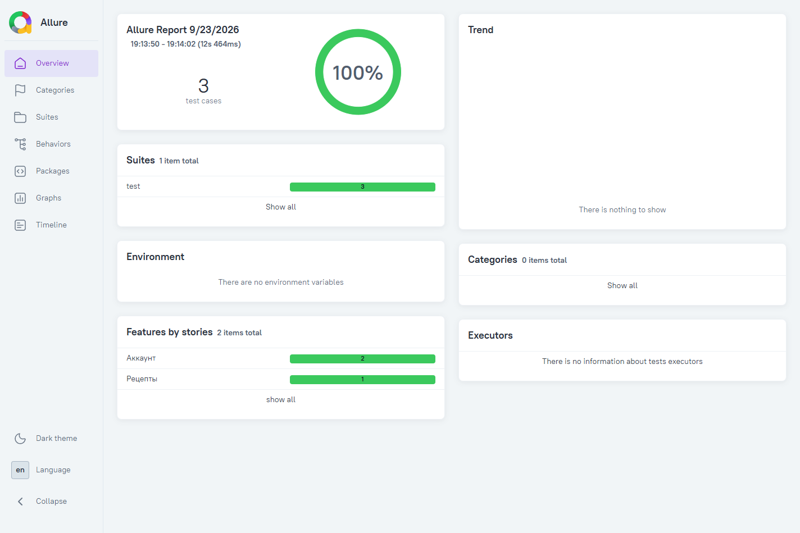

# Sprint_9 — UI-тесты Foodgram

Автоматизированные тесты сервиса [«Продуктовый помощник»](https://foodgram-frontend-1.foodgram.education-services.ru/).
Проект использует Python, pytest, Selenium и Allure. Тесты запускаются
в локальном Chrome или в Docker Compose через Selenoid.

## Тестовые сценарии

| Функциональность | Модуль и класс | Проверки |
| --- | --- | --- |
| Создание аккаунта | `test/test_registration.py`, `TestRegistration` | После регистрации открывается страница авторизации и отображается форма входа |
| Авторизация | `test/test_login.py`, `TestLogin` | После входа открывается главная страница и отображается кнопка «Выход» |
| Создание рецепта | `test/test_create_recipe.py`, `TestCreateRecipe` | После заполнения формы, выбора ингредиента из списка и загрузки изображения отображается карточка с указанным названием |

## Структура проекта

```text
Sprint_9/
├── .github/
│   └── workflows/
│       └── ci.yml              # GitHub Actions
├── test/                       # тестовые модули
├── pages/                      # классы Page Object
├── locators/                   # локаторы элементов
├── assets/recipe.png           # изображение для загрузки
├── config/browsers.json        # конфигурация Chrome для Selenoid
├── docs/images/                # скриншоты
├── conftest.py                 # фикстуры и диагностика ошибок
├── data.py                     # тестовые данные и настройки
├── helpers.py                  # генерация данных и работа с API
├── urls.py                     # адреса страниц и API
├── pytest.ini                  # настройки pytest и Allure
├── requirements.txt            # зависимости
├── Dockerfile                  # образ с тестами
├── docker-compose.yml          # сервисы tests и selenoid
├── .dockerignore
├── .gitignore
├── allure-results/             # результаты тестов
└── allure-report/              # локальный HTML-отчёт, исключён из Git
```

Для каждой страницы предусмотрен отдельный класс. Тесты взаимодействуют
с интерфейсом через методы Page Object; определения локаторов находятся
в пакете `locators`. Ожидания реализованы через `WebDriverWait`.

Фикстуры создают отдельную браузерную сессию и уникальные данные для
каждого теста. Для авторизации и создания рецепта пользователь
регистрируется через API. В тесте регистрации аккаунт создаётся через UI.
После выполнения сценария фикстуры удаляют созданные рецепты и отзывают
токен пользователя. Закрытие браузера выполняется в блоке `finally`.

## Требования

- Python 3.13 и Chrome для локального запуска.
- Docker с поддержкой Linux-контейнеров и Docker Compose для запуска через Selenoid.
- Allure CLI и Java для генерации и просмотра HTML-отчёта.
- Доступ к учебному сервису и реестрам зависимостей при первой установке.

Версии Python-зависимостей зафиксированы в `requirements.txt`.
В контейнерах используется Chrome 128.0 и Selenoid 1.11.3.
pytest 9.0.3 выбран с учётом
[совместимости с allure-pytest 2.16.0](https://github.com/allure-framework/allure-python/issues/918).

## Локальный запуск

Команды для Windows PowerShell выполняются из корня проекта.

Создание виртуального окружения и установка зависимостей:

```powershell
python -m venv .venv
.\.venv\Scripts\python.exe -m pip install -r requirements.txt
```

Запуск всех тестов:

```powershell
.\.venv\Scripts\python.exe -m pytest
```

Запуск без видимого окна Chrome:

```powershell
.\.venv\Scripts\python.exe -m pytest --headless
```

ChromeDriver подбирается автоматически через Selenium Manager.

Отдельный сценарий с сохранением результатов в другой каталог:

```powershell
.\.venv\Scripts\python.exe -m pytest test/test_create_recipe.py --headless --alluredir=.work/check-results
```

По умолчанию результаты сохраняются в `allure-results/`. Параметр
`--clean-alluredir` в `pytest.ini` очищает выбранный каталог результатов
перед каждым прогоном.

## Запуск через Docker Compose

Загрузка образов Selenoid и браузера:

```powershell
docker pull selenoid/chrome:128.0
docker compose pull selenoid
```

Сборка образа и запуск тестов:

```powershell
docker compose up --build --abort-on-container-exit --exit-code-from tests
```

Параметр `--exit-code-from tests` возвращает код завершения pytest.
Успешному прогону соответствует код `0`. Перед запуском тестов
Compose проверяет готовность Selenoid через healthcheck.

Остановка и удаление контейнеров проекта:

```powershell
docker compose down
```

Результаты сохраняются в локальный каталог `allure-results/` через
bind mount. Selenoid запускает браузеры в сети `sprint9_default`.
Для взаимодействия с Docker задана версия API `1.44`.
Порт Selenoid опубликован на `127.0.0.1:4444`.

Запуск локальных Python-тестов с браузером в Selenoid:

```powershell
docker compose up -d --wait selenoid
.\.venv\Scripts\python.exe -m pytest --selenoid-uri=http://localhost:4444/wd/hub
docker compose down
```

Адрес удалённого WebDriver задаётся параметром `--selenoid-uri` или
переменной `SELENOID_URI`. Версия браузера задаётся через
`--browser-version` и должна присутствовать в `config/browsers.json`.

## Allure

Генерация и просмотр HTML-отчёта:

```powershell
allure generate allure-results --clean -o allure-report
allure open allure-report
```

В проект включены исходные результаты `allure-results/`.
Каталог `allure-report/` генерируется локально и исключён через `.gitignore`.
При ошибке теста в Allure прикладываются скриншот страницы и её URL.



## GitHub Actions

Конфигурация пайплайна находится в
[`.github/workflows/ci.yml`](.github/workflows/ci.yml).
Запуск выполняется при push, pull request и вручную через `workflow_dispatch`.

Этапы пайплайна:

1. Получение исходного кода и очистка предыдущих результатов.
2. Загрузка образов Selenoid и Chrome.
3. Сборка Docker-образа с тестами.
4. Запуск тестов через Docker Compose.
5. Сохранение результатов Allure и логов контейнеров в артефактах.
6. Остановка контейнеров.

Артефакты `allure-results` и `docker-compose-logs` хранятся 14 дней.
Для выполнения сценариев используются автоматически создаваемые
тестовые аккаунты; GitHub Secrets не требуются.

## Тестовые данные и ограничения стенда

Данные пользователей и рецепта находятся в `data.py`.
Имена пользователей и названия рецептов содержат уникальный идентификатор.
Файл для загрузки расположен в `assets/recipe.png`, путь к нему
формируется через `pathlib.Path`. При работе с удалённым браузером
`LocalFileDetector` передаёт файл из контейнера тестов в контейнер Chrome.

Для учебного стенда значения `username` и `email` совпадают:
обработчик входа принимает поле `email`, но использует имя пользователя
для авторизации. Адрес API задаётся в `urls.py` отдельно от адреса фронтенда.

Удаление аккаунтов через API стенда возвращает код 405.
Поэтому очищаются рецепты и токены, а уникальные аккаунты остаются
на сервере. Тесты не используют пользователей из предыдущих прогонов.
